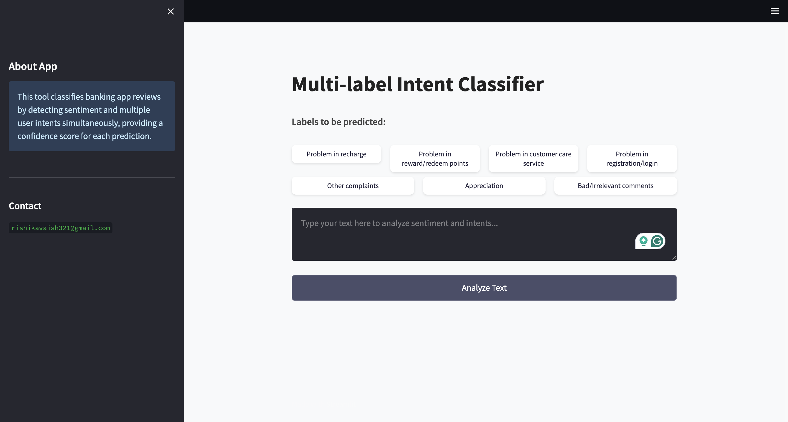
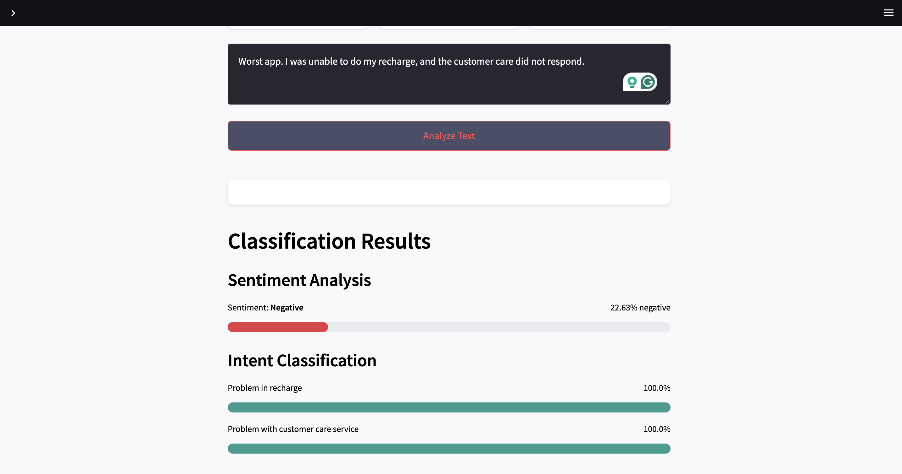

# Multi-Label Intent Classifier for Google Play Store App Reviews

A Natural Language Processing (NLP) project submitted for **CS6320 - Natural Language Processing (Spring 2025)** at **The University of Texas at Dallas**.

**By:** Rishika Vaish  
**Instructor:** Dr. Tatiana Erekhinskaya

---

## Project Demo

Watch the 5-minute project walkthrough and demo on YouTube:  
👉 [Click to Watch](https://youtu.be/BTbv_WKnj1g?si=ZQOHf2RrdooR572V)

---

## Project Overview

This project analyzes user reviews from Google Play Store apps and automatically classifies them by:

- **Sentiment** (Positive, Neutral, Negative)  
- **Multiple Intents** per review (e.g., Recharge issue + Customer care problem)

The goal is to help app developers extract meaningful, categorized insights from unstructured textual feedback, enabling quicker resolution and product improvements.

---

## Key Features

- **Preprocessing** using NLTK (tokenization, stopword removal, lemmatization)
- **Sentiment Analysis** via VADER
- **Clustering** with TF-IDF + K-Means to pre-label reviews
- **Multi-Label Classification** using fine-tuned XLNet model
- **Real-Time Web App** built with Streamlit
- **Confidence Scores** are shown for each detected label

---

## Intent Labels Detected

The model identifies one or more of the following intents:

- Problem with recharge  
- Problem with reward/redeem points  
- Problem in customer care service  
- Problem in registration/login  
- Other complaints  
- Appreciation  
- Bad/Irrelevant comments  

---

## Sample Screenshots

### Web Interface


### Classification Result Example


---

## Getting Started

### Installation

Clone the repo:

```bash
git clone https://github.com/rishika7006/intent-classifier-xlnet.git
cd intent-classifier-xlnet
```

Install dependencies:

```bash
pip install -r requirements.txt
```

### Run the Streamlit App

```bash
streamlit run 03_multilabel_classifier_app.py
```

> Related repo: [sentiment-intent-app](https://github.com/rishika7006/sentiment-intent-app) — Streamlit dashboard that applies this XLNet classifier end-to-end on scraped Play Store reviews.

---

## Testing & Feedback

Testing was conducted with 5 independent users.  
🔹 Positive feedback on ease of use and multi-intent detection  
🔹 Suggested improvements:  
- Add progress tracker  
- Speed up backend  
- More detailed intent descriptions

---

## Lessons Learned

- Balancing model performance with real-time speed is crucial for web apps
- XLNet worked effectively for capturing nuanced, multi-intent review content
- TF-IDF clustering gave a strong starting point for label design
- User feedback was essential for refining app usability

---

## Final Report

📄 You can find the full project report [here](NLP_Project_Report.pdf)

---

## Contact

Feel free to reach out if you'd like to collaborate or discuss the project!

**Rishika Vaish**  
CS6320 - Natural Language Processing  
The University of Texas at Dallas
